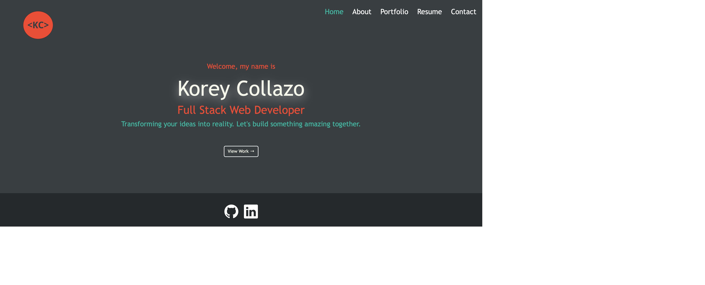

# react-portfolio

## Description
The purpose of this project was to create a place to share my work that also demonstrates my knowledge of the latest technologies. This was achieved by creating a dynamic single page application using Reactjs.

## Table of Contents
  - [Installation](#installation)
  - [Usage](#usage)
  - [Credits](#credits)
  - [License](#license)
  
## Installation
N/A

## Usage
[Website](https://koreycollazo.github.io/react-portfolio/#home)

## Credits   

N/A
 
## License

N/A

## Tests

N/A

## Questions
For additional projects my github username is [KoreyCollazo](https://github.com/KoreyCollazo)

If you have any questions or wish to contact me, please reach out to Koreycollazo@gmail.com. Thanks!

